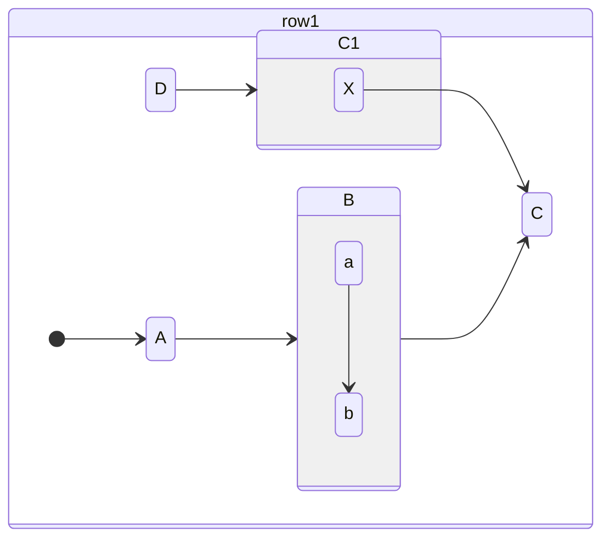
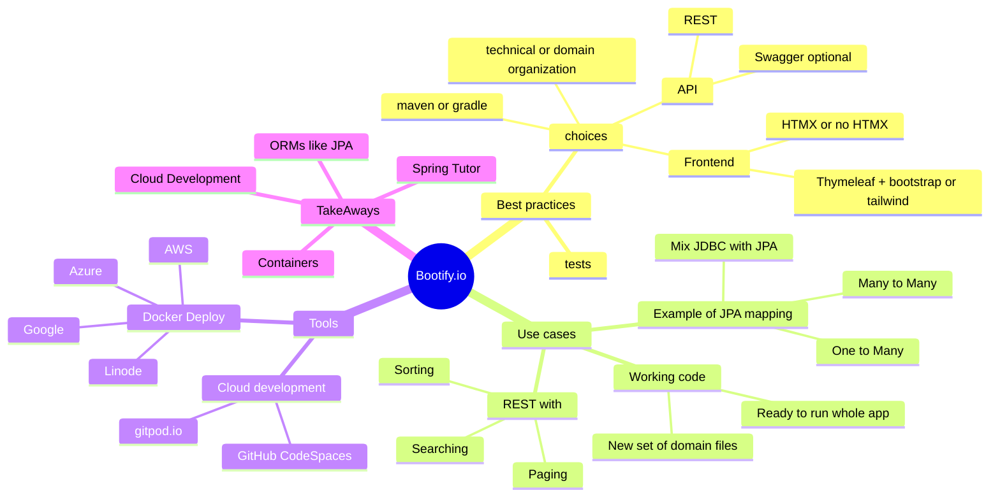

# mermaid-diagrams
mermaidJS diagrams I think are interesting

## State Machine Example

```mermaid
stateDiagram
    state row1 {
        D --> C1
        state C1 {
            X --> C
        }
        direction LR
        [*] --> A
        A --> B
        B --> C
        state B {
          direction TB
          a --> b
        }
    }
```

https://mermaid.js.org/syntax/stateDiagram.html has some documentation

## Bootify ideas

```mermaid

mindmap
  root((Bootify.io))
    Best practices
      tests
      ::icon(fa fa-check-circle)
      choices
        maven or gradle
        technical or domain organization
        API
           REST
           Swagger optional
        Frontend
           Thymeleaf + bootstrap or tailwind
           HTMX or no HTMX
    Use cases
      Working code
        Ready to run whole app
        New set of domain files
      REST with 
        Paging
        Searching
        Sorting
      Example of JPA mapping
        Many to Many
        One to Many
        Mix JDBC with JPA
    Tools
      Cloud development
        gitpod.io 
        GitHub CodeSpaces
      Docker Deploy
        Linode
        AWS
        Google
        Azure
    TakeAways
      Spring Tutor
      ORMs like JPA
      Cloud Development 
      Containers

```

